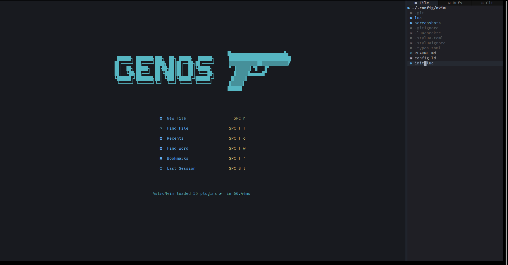
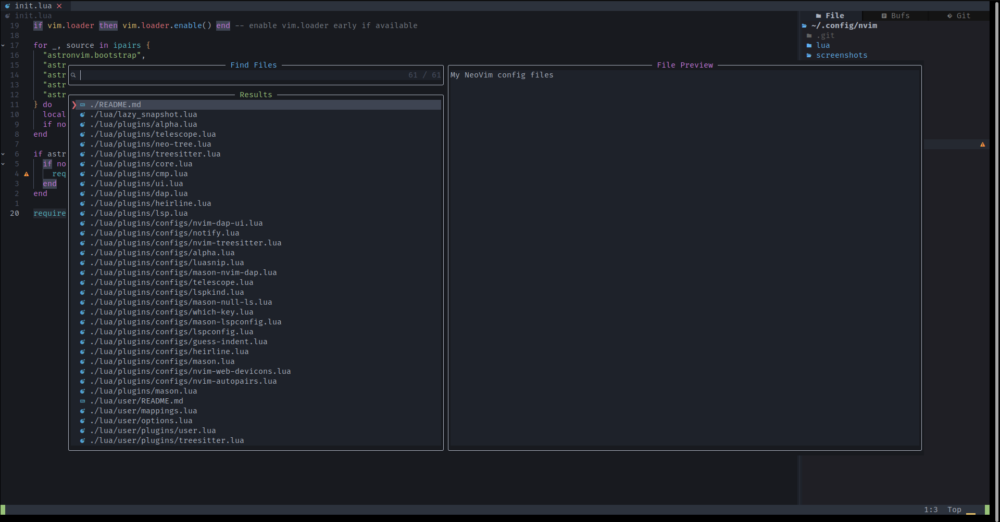
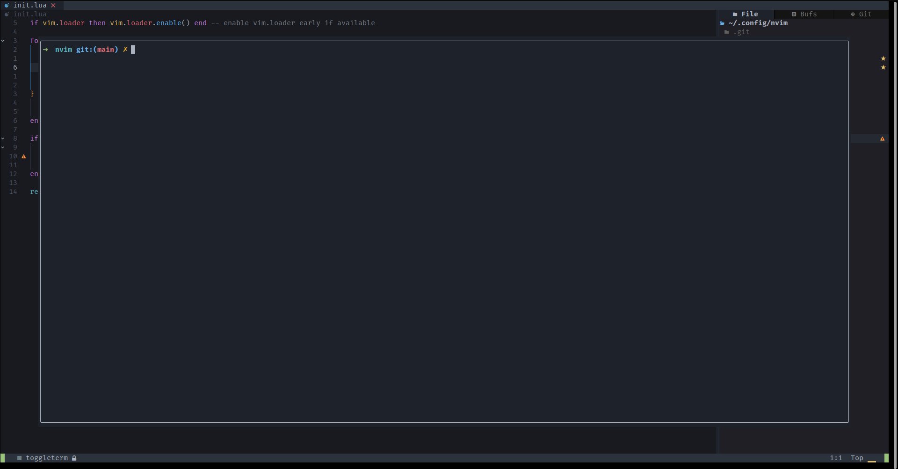

### VimConfig

This neovim setup is configured with AstroNvim

Required Version: neovim >= 8.1

```sh
curl https://github.com/neovim/neovim/releases/latest/download/nvim-linux64.tar.gz -o ~/Downloads/nvim-linux64.tar.gz
tar xzvf nvim-linux64.tar.gz -C /opt
sudo ln -s /opt/nvim-linux64/bin/nvim /usr/local/bin/nvim
gh repo clone m3rashid/vimconfig ~/.config/nvim
```






